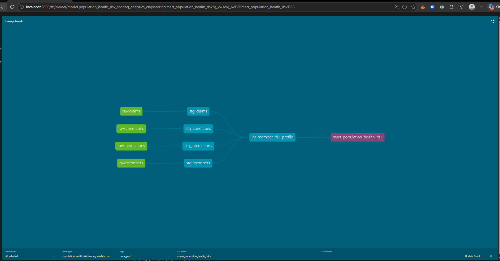

# Population Health Risk Scoring Analytics Engineering Project

## Overview

This project shows a modern healthcare analytics engineering workflow focused on population health risk scoring, utilization analysis, chronic condition burden, and outreach engagement analytics.

The pipeline was designed using an Analytics Engineer-style architecture with layered dbt models, data quality testing, documentation, and exploratory Python analytics using Jupyter notebooks.

The project demonstrates how healthcare claims, chronic condition, and member outreach data can be transformed into actionable member-level population health insights.

---

# Business Problem

Healthcare organizations and care management teams need a scalable way to:

* Identify high-risk members
* Monitor utilization trends
* Track chronic disease burden
* Measure outreach engagement effectiveness
* Prioritize intervention efforts

This project builds a member-level risk mart that combines utilization, condition burden, and engagement activity into a unified analytics layer.

---

# Tech Stack

* dbt
* DuckDB
* Python
* Pandas
* Plotly
* Jupyter Notebook
* VS Code
* Git/GitHub

---

# Project Structure

```text
population-health-risk-scoring-analytics-engineering/
│
├── data/
│   ├── raw/
│   └── processed/
│
├── docs/
│   ├── architecture.md
│   ├── join_logic.md
│   ├── stakeholder_notes.md
│   └── validation_notes.md
│
├── models/
│   ├── staging/
│   ├── intermediate/
│   └── marts/
│
├── notebooks/
│   ├── 01_generate_synthetic_data.ipynb
│   └── 02_population_health_analysis.ipynb
│
├── logs/
├── seeds/
├── snapshots/
└── README.md
```

---

# Analytics Engineering Workflow

## Staging Layer

The staging models standardize raw source data and apply light cleansing/transformation logic.

### Models

* stg_members
* stg_claims
* stg_conditions
* stg_interactions

### Key Transformations

* standardized column naming
* date casting
* source normalization
* lightweight validation

---

## Intermediate Layer

The intermediate layer aggregates business metrics at the member level.

### Model

* int_member_risk_profile

### Business Logic

* total claims per member
* total paid amount
* inpatient admission counts
* chronic condition burden
* outreach activity metrics
* successful engagement metrics

---

## Mart Layer

The mart layer creates a final analytics-ready population health dataset.

### Model

* mart_population_health_risk

### Derived Metrics

* engagement_status
* population_risk_tier

### Risk Tier Logic

Members are classified into:

* Low
* Medium
* High

Based on:

* chronic condition burden
* inpatient utilization
* total paid amount

---

# Data Quality Testing

dbt tests were implemented to validate model integrity and business logic.

## Tests Included

### member_id

* not_null
* unique

### population_risk_tier

* accepted_values:

  * Low
  * Medium
  * High

### engagement_status

* accepted_values:

  * Engaged
  * Not Engaged

---

# Python Analytics & Visualization

Jupyter notebooks were used for exploratory healthcare analytics and visualization.

## Notebook Features

### Population Health Analysis

* risk tier distribution
* engagement analysis
* utilization analysis
* chronic condition analysis

### Interactive Plotly Visualizations

* bar charts
* scatter plots
* correlation heatmaps
* engagement analysis visuals

---

# Advanced Analytics Section

## Feature Engineering

Additional healthcare features were engineered to support future predictive modeling workflows.

### Engineered Features

* engaged_flag
* utilization metrics
* chronic condition metrics
* outreach activity metrics

---

## Outreach Success Modeling Exploration

The project explores how utilization and chronic disease burden may influence successful outreach engagement.

### Analytical Areas

* engagement correlation analysis
* utilization vs engagement analysis
* risk tier behavioral patterns
* outreach effectiveness exploration

---

# Example Business Questions Answered

* Which members are considered highest risk?
* Which members have the highest utilization?
* How does chronic condition burden impact risk classification?
* Are outreach attempts associated with successful engagement?
* Which populations may require proactive intervention?

---

# Key Skills Demonstrated

## Analytics Engineering

* layered dbt architecture
* source configuration
* modular SQL modeling
* YAML testing
* documentation workflows

## Healthcare Analytics

* utilization analytics
* population health metrics
* chronic condition analysis
* engagement analysis
* risk scoring logic

## Python Analytics

* DuckDB integration
* Pandas analysis
* Plotly visualization
* feature engineering
* exploratory analytics

---

# Future Enhancements

Potential future improvements include:

* machine learning risk prediction
* outreach success prediction models
* clustering analysis
* dbt snapshots
* incremental models
* orchestration workflows
* dashboard integration
* healthcare KPI monitoring

---

# Sample Visualizations

The notebook includes:

* Population Risk Tier Distribution
* Outreach Engagement Analysis
* Correlation Matrix of Population Health Metrics
* Utilization vs Engagement Scatterplots

---

# Validation & QA

Validation steps included:

* dbt test execution
* row count validation
* accepted value checks
* null validation
* member uniqueness validation
* notebook sanity checks

---

# Outcome

This project demonstrates an end-to-end healthcare analytics engineering workflow combining:

* dbt transformation layers
* healthcare business logic
* data quality testing
* Python analytics
* interactive visualizations
* documentation best practices

The final dataset supports population health analytics, risk stratification, and engagement-focused healthcare analysis.

## dbt Lineage


